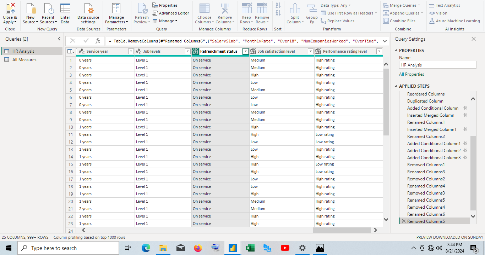
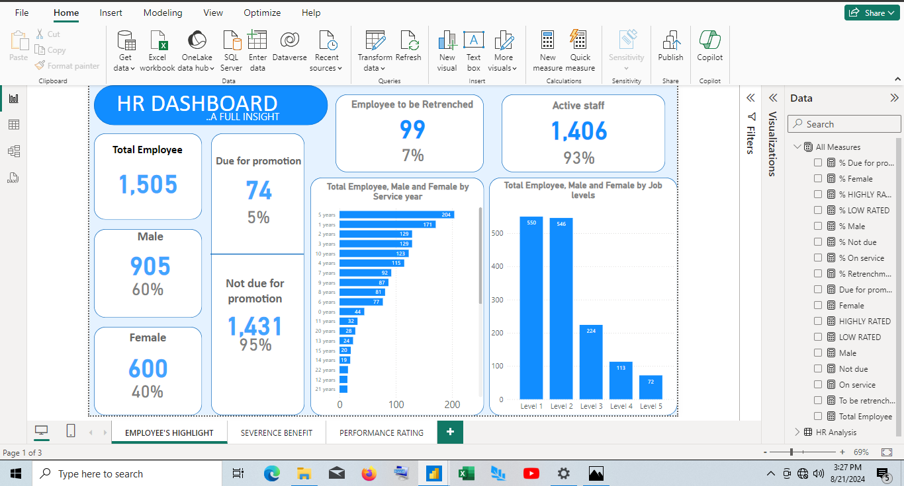
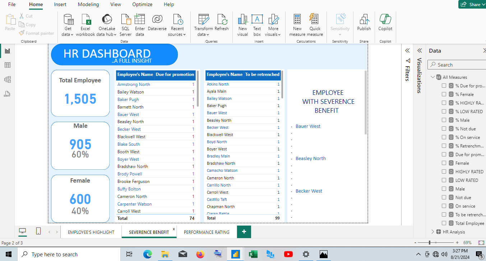
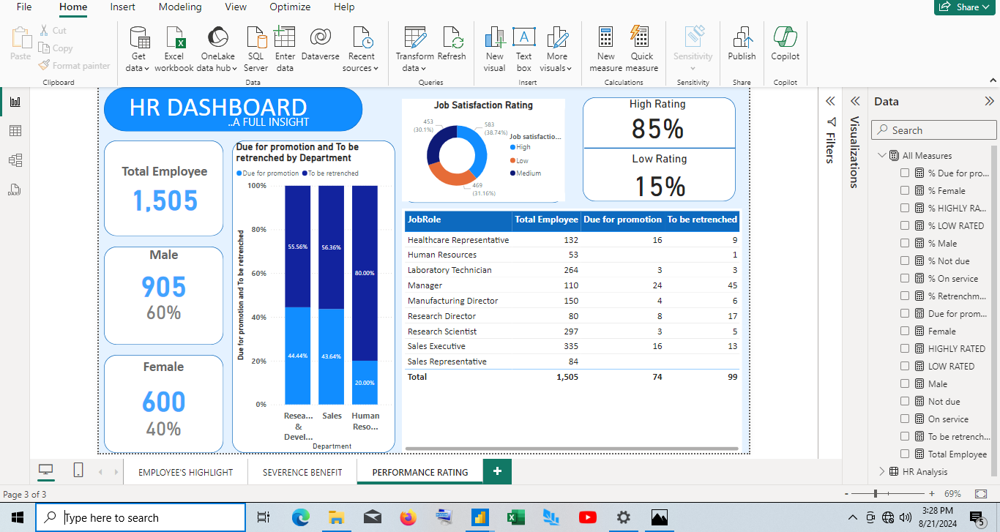

# HR-DASHBOARD

## Introduction

**Y & Z Housing** is a leading real estate that provide the highest number of decent, comfortable and affordable houses.

**Y & Z Housing** is grappling with the issue of monitoring the comprehensive view of the organization’s promotion and retrenchment activities. As a data analyst, I was given the task to track key metrics to help the company’s HR professionals make informed decision regarding workforce planning and management.

**_DISCLAIMER_**: _All dataset or report do not represent any company. But just a dummy dataset to represent the capabilities of power Bi_

## Problem Statement

-	What is the total count of employee?
-	Identify the rate of employee due for promotion compared to the rate of employee to be retrenched
-	Extract the names of employee due for promotion that coincidentally have their names on retrenchment list so as to be compensated.
-	What is the highest rate of retrenchment and promotion by department?

## Skills Demonstrated

  The following Power Bi and Excel skills were demonstrated:
-	Dax functions
-	Power Query (Data cleaning, column from examples, column with condition)
-	Excel functions

## Dataset

  

## Modelling

There are no modelling to this dataset, as it contains only one table.

## Visualisation

## Observation

-	Total number of employee are 1,505, comprising of 905 males and 600 females . 5% of the total employees are due for promotion. They are being evaluated by the year they were last promoted. Employee who was last promoted in the last 10 years was due for promotion 
-	Due to the high cost on the part of the organization, organization use retrenchment as cost reduction mechanism to deplete personnel cost. 7% of the total employee are put up for retrenchment. Employee who have stayed for 20 years and above are put up for retrenchment
-	10 names of employee whose name are on promotion list and as well on the retrenchment list were identified so as to be compensated with the severance benefits.
-	The department that has the highest retrenchment list is the Human Resource department which has 80% employee to be retrenched, and Research and development department has the highest promotion list which is 44.44%.

## Recommendation

Organization should adopt new measures to reduce labour cost rather than laying off of staffs. Few of the measures is what I will be listing below:
-	Hiring the right talent – this will help to improve efficiency and reduce turnover

-	Look out for an experienced  employee – highly experienced individuals work more efficiently and are less prone to mistakes. The more familiar someone is with their required task, the faster they work. That means more output per hour.

- Allow flexible working conditions – the increase in remote work environment has opened up possibilities to employees in such a way that most remote employees would rather take a pay cut than return to an office environment.

	 

  

  
